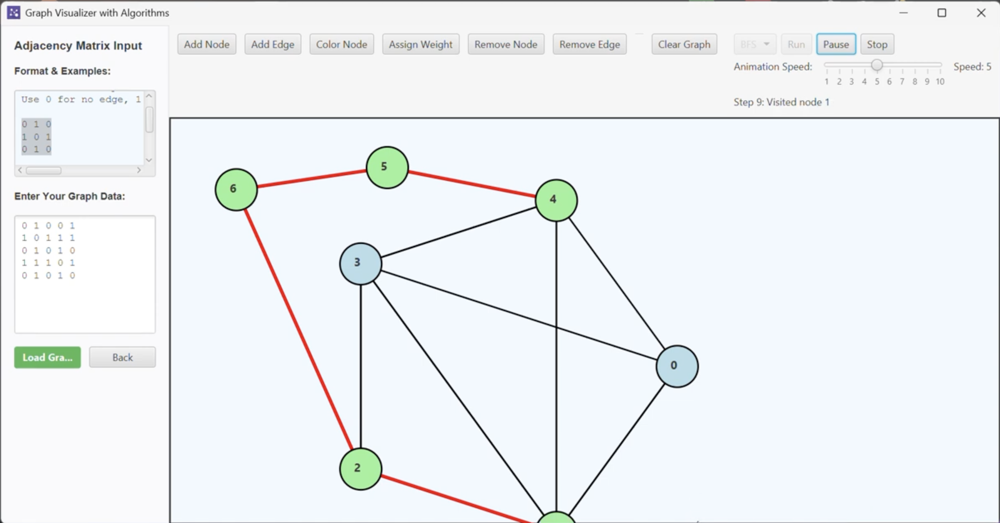

<!--  -->

# AlgoMania
## [Watch YouTube demo](https://www.youtube.com/watch?v=R8U2GAA77SI)
[](https://www.youtube.com/watch?v=R8U2GAA77SI)
<!-- [](https://www.youtube.com/watch?v=R8U2GAA77SI) 
[](https://www.youtube.com/watch?v=R8U2GAA77SI)
[](https://www.youtube.com/watch?v=R8U2GAA77SI)
[](https://www.youtube.com/watch?v=R8U2GAA77SI)

[](https://www.youtube.com/watch?v=R8U2GAA77SI)
[](https://www.youtube.com/watch?v=R8U2GAA77SI)
[](https://www.youtube.com/watch?v=R8U2GAA77SI)
-->
---

Welcome to AlgoMania — an interactive Algorithm & Data Structures Visualizer built with Java and JavaFX. AlgoMania provides visual, hands-on simulations for data structures, graph algorithms, and sorting algorithms with a modern UI and educational control panels.


---

### Table of contents
- Overview
- Key Features
- Screenshots
- Prerequisites
- Getting started
  - Clone
  - Run in IntelliJ IDEA IDE (recommended)
  - Run from command line
  - Build with Maven/Gradle (guidance)
- Project structure (high level)
- Main modules & dependencies
- Usage (what each module does)
- Developer notes & tips
- Contribution guide
- License & acknowledgements
- Contact

---

### Overview
--------
AlgoMania is an educational desktop application demonstrating classic data structures, graph visualizations/interactions, and sorting simulations. The project uses Java modules and JavaFX for rendering interactive canvases and control panels. It was designed to make learning algorithms more visual and intuitive.

### Key Features
------------
- Interactive data structures visualizer (Arrays, Singly/Doubly Linked Lists, Stack, Queue, Heap, Binary Search Tree, etc.)
- Graph visualizer and interaction palette (create nodes/edges, run algorithm demos, etc.)
- Sorting simulator UI (visualize sorting process)
- Modern JavaFX-based UI with custom styling and control panels
- Modularized with Java module-info for explicit JavaFX and third-party dependencies

### Screenshots
-----------
**Main menu / dashboard (AlgoMania)**
  

**Data Structures Visualizer (Array / Linked List / Tree views)**
  

**Graph Visualizer with control panel and input panel**
  

**Sorting Simulator showing step-by-step sorting**
  


### Prerequisites
-------------
- JDK 17+ (recommended) or a modern JDK compatible with Java modules
- JavaFX SDK (a copy of JavaFX 24.0.1 is present in the repo under `javafx-sdk-24.0.1/` but you can also use your system JavaFX installation)
- An IDE that supports Java modules (IntelliJ IDEA, Eclipse, or VS Code with Java extensions)
- (Optional) Maven or Gradle if you add a build file

### Getting started
---------------

Clone the repository

```bash
git clone https://github.com/ShadmanSShuvo/AlgoMania.git
cd AlgoMania
```

Run in an IDE (recommended)
- Import the project as a Java project and make sure the module path includes your JavaFX SDK.
- Add VM options (example) to run configurations:
  --module-path /path/to/javafx-sdk-24.0.1/lib --add-modules=javafx.controls,javafx.fxml,javafx.web
- Run the main class `edu.buet.shayan.algomania.AlgoMania`.

Run from the command line (compiling & running)
- Example compile (Unix-like shell). Adjust paths and separators for Windows:
  1. Compile:
     javac --module-path javafx-sdk-24.0.1/lib --add-modules=javafx.controls,javafx.fxml,javafx.web -d out $(find src/main/java -name "*.java")
  2. Run:
     java --module-path javafx-sdk-24.0.1/lib:out --add-modules=javafx.controls,javafx.fxml,javafx.web -cp out edu.buet.shayan.algomania.AlgoMania

- Note: Adjust the `--module-path` path to where JavaFX libs are located on your machine. On Windows, use `;` as path separator for the `--module-path` arguments when appropriate with shell quoting.

Build with Maven or Gradle
- This project currently doesn't contain an explicit Maven/Gradle build file in the repo snapshot. To build with Maven or Gradle:
  - Add a `pom.xml` or `build.gradle` and include JavaFX dependencies (or configure a plugin to attach the JavaFX SDK).
  - Use the JavaFX Maven Plugin or `org.openjfx` plugin for Gradle to configure module path and runtime arguments.

### Project structure (high-level)
------------------------------
- src/main/java/edu/buet/shayan/algomania
  - AlgoMania.java — main entry point and main menu/dashboard UI
  - datastructures/
    - DataStructuresVisualizer.java — main window for data structure visualizations (canvas, control panel)
    - Visual* classes — visual implementations for array, linked list, stack, queue, heap, BST, etc.
  - graph/
    - GraphVisualizerApp.java — graph visualization application logic
    - ui/ — Graph UI components (GraphCanvas, ControlPanel, InputPanel)
    - model/ — GraphModel and related classes
    - interaction/ — e.g., ModeManager for different interaction modes
  - sorting/
    - SortingSimulator.java — UI and driver for sorting visualizations
  - images/ — image assets used by the UI (note: some files reference absolute paths which should be fixed)
- javafx-sdk-24.0.1/ — included JavaFX SDK resources & legal notices (present in repository snapshot)

### Main modules & dependencies
---------------------------
The Java module descriptor (module-info.java) declares dependencies used by the project:
- requires javafx.controls
- requires javafx.fxml
- requires javafx.web
- requires org.controlsfx.controls
- requires com.dlsc.formsfx
- requires net.synedra.validatorfx
- requires org.kordamp.ikonli.javafx
- requires org.kordamp.bootstrapfx.core
- requires eu.hansolo.tilesfx
- requires com.almasb.fxgl.all

If you don't want to use all third-party libraries, the core experience should still work with JavaFX modules (controls and fxml), though some UI enhancements might require installing/adding these libraries on the module path.

### Usage / What each part does
--------------------------
- AlgoMania (main) — Presents a dashboard with options for Graphs, Sorting, and Data Structures. Click the Data Structures panel to launch the Data Structures Visualizer.
- DataStructuresVisualizer — Choose a structure (Array, SLL, DLL, Stack, Queue, Heap, BST). Use the control panel to insert, delete, search, peek, or perform indexed operations where supported.
- Graph Visualizer — Create graphs from text input or through interactive canvas operations. Tools exist for mode management (add/remove nodes, connect edges) and a control panel for running or simulating graph algorithms.
- Sorting Simulator — Visualize sorting algorithms step-by-step (sorting algorithms are implemented in the sorting package).

### Developer notes & tips
----------------------
- Resource paths: The repository contains code that loads images with absolute Windows paths (e.g., "C:\Users\hp\Desktop\AlgoMania\..."). To make the app portable, change the code to load resources from the classpath (use getResource or resource streams). Example:
  Image icon = new Image(getClass().getResourceAsStream("/edu/buet/shayan/algomania/images/main_icon.png"));
- Modules: The project uses Java modules. When running from IDE or CLI, ensure JavaFX jars are on the module path and not just the classpath.
- Common runtime VM args:
  ```
  --module-path /path/to/javafx-sdk-24.0.1/lib --add-modules=javafx.controls,javafx.fxml,javafx.web
  ```
- If you add a build system (Maven/Gradle), use the OpenJFX artifacts (org.openjfx:javafx-*) for your platform, or configure the JavaFX SDK plugin.
- Packaging: If you wish to distribute a native installer, consider jlink or jpackage (both require module-awareness and proper module configuration).

### Contributing
------------
Contributions are welcome. A suggested workflow:
1. Fork the repository.
2. Create a feature branch (e.g., feature/fix-resource-paths).
3. Make changes with clear commit messages.
4. Open a pull request describing the change purpose and testing steps.

Guidelines:
- Maintain consistent code style used in the repository (Java 11+/module conventions).
- Prefer loading UI resources from the classpath (relative paths) for portability.
- If adding third-party libraries, update module-info.java and document any required VM arguments.

### Known issues & common fixes
---------------------------
- Missing JavaFX runtime / NoClassDefFoundError: Ensure JavaFX SDK path is set and included with --module-path and --add-modules flags.
- Images not appearing: Fix absolute paths and use resources bundled in JAR or module resources.
- If running on a different OS, ensure you use the correct JavaFX binaries for your platform (Linux/Windows/macOS).

### License & acknowledgements
--------------------------
- License: MIT License
- Acknowledgements:
  - JavaFX for UI rendering
  - ControlsFX, FormsFX, ValidatorFX, Ikonli, BootstrapFX, TilesFX, FXGL referenced in module-info for enhanced UI components. See module-info.java for the full list.

### Contact
-------
If you'd like to collaborate or report issues, open an issue in the repository or reach out via GitHub: https://github.com/ShadmanSShuvo

---

### Quick checklist to get the project running locally
1. Install JDK (17+ recommended).
2. Ensure JavaFX SDK is present (the repository has a `javafx-sdk-24.0.1` folder in this snapshot).
3. Update resource/image loading code to use classpath resources (recommended).
4. Launch `edu.buet.shayan.algomania.AlgoMania` with JavaFX module arguments in your IDE or from the CLI.

Enjoy exploring algorithms visually with AlgoMania!
